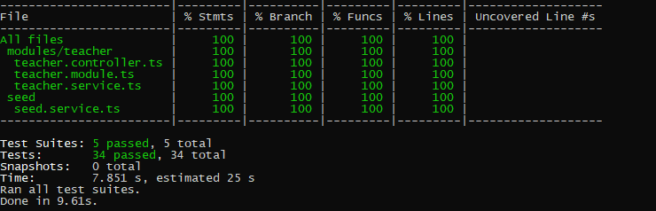
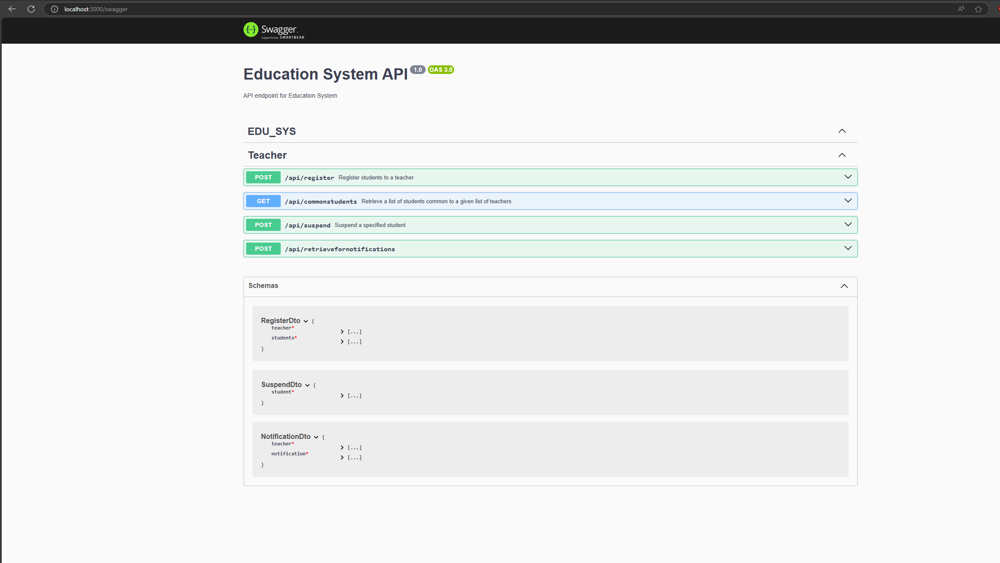

# Education System Backend

## Overview
Education sytem is a backend service designed to help teachers perform administrative functions for their students. It's built using the NestJS framework, offering robust API endpoints for clients.

## Table Of Content
- [Overview](#overview)
- [Table Of Content](#table-of-content)
- [Tech stacks](#tech-stacks)
- [Source structure](#source-structure)
- [Test coverage](#test-coverage)
- [Swagger](#swagger)
- [How to run](#how-to-run)
  - [Pre-requisites](#pre-requisites)
  - [Installation](#installation)
  - [Environment setup](#environment-setup)
  - [Seeding](#seeding)
  - [Postman Collection for testing](#postman)
- [Development](#development)
- [Contact](#contact)

## Features
- Teacher can register students.
- Teacher can retrieve a list of students common to a given list of teachers.
- Teacher can suspend a specified student.
- Teacher can retrieve a list of students who can receive a given notification.

## Tech stacks
- **Backend Framework**: NestJS
- **Database**: MySQL with TypeORM
- **Testing**: Jest
- **Code Formatting and Linting**: ESLint, Prettier


## Source structure
```tree
...
├── src/
│   ├── app.module.ts
│   ├── main.ts
│   ├── entities/
│   │     ├── student.entity.ts
│   │     └── teacher.entity.ts

│   ├── dtos/
│   │     ├── notification.dto.ts
│   │     └── register.dto.ts
│   │     └── suspend.dto.ts
│   ├── modules/
│   │     └── teacher/
│   │           ├── teacher.controller.ts
│   │           ├── teacher.module.ts
│   │           ├── teacher.service.ts
│   │     └── test/
│   │           ├── teacher.controller.spec.ts
│   │           ├── teacher.module.spec.ts
│   │           ├── teacher.service.spec.ts
│   ├── seed/
│   │     └── test/
│   │           ├── seed.service.spec.ts
│   │     └── seed.service.ts
├── .env
├── package.json
├── app.modules.ts
└── main.ts
```

## Test coverage


## Swagger
Swagger API URL: http://localhost:3000/swagger


## How to run
### Pre-requisites
- Node.js v18.19.0
- Postman

### Installation
To install the project, follow these steps:

1. Clone the repository
```bash
git clone https://github.com/Cuon7/govtech_backend.git
cd govtech_backend
```

2. Install dependencies (Delete yarn.lock if error occurs)

   ```bash
    yarn install
   ```

### Environment setup

To run this project, you will need to set up the following environment variables. You can do this by creating a `.env` file in the root directory.
```plaintext
# MySQL Database
#===
DB_HOST=YOUR_DB_HOST
DB_PORT=YOUR_DB_PORT
DB_USER=YOUR_USER_NAME
DB_PASS=YOUR_PASSWORD
DB_NAME=YOUR_DB_NAME
```

### Seeding

After the server is successfully up and running, if there is no data in the table, the app will automatically seed data.

### Postman

- Attach the postman file: [Postman File](/Edu%20Sys%20APIs.postman_collection.json)

## Development
### Start application
```bash
yarn start dev
```

### Run test
To run tests:
```bash
yarn test
```

## Contact
- Email: cuon7.work@gmail.com
- Github: cuon7